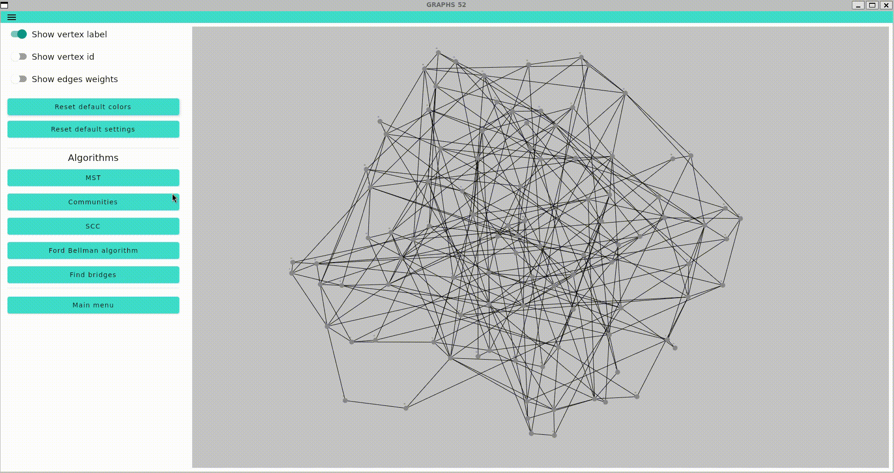
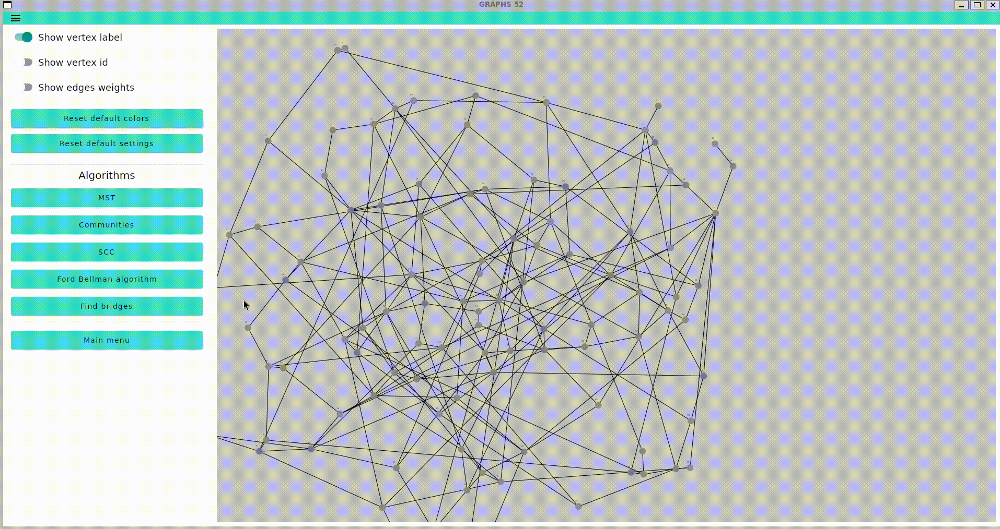
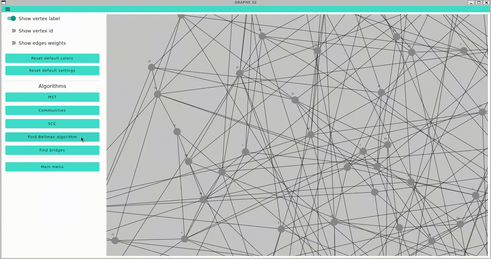
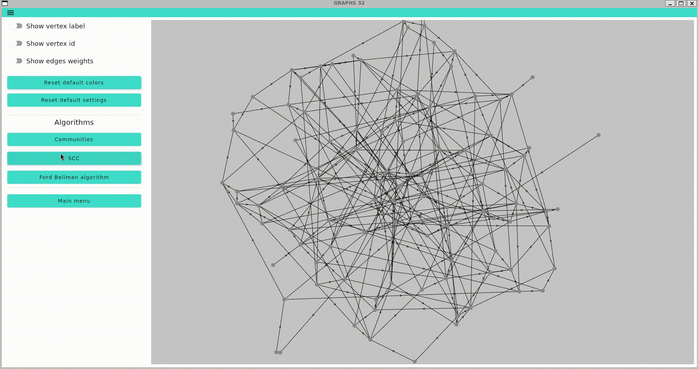
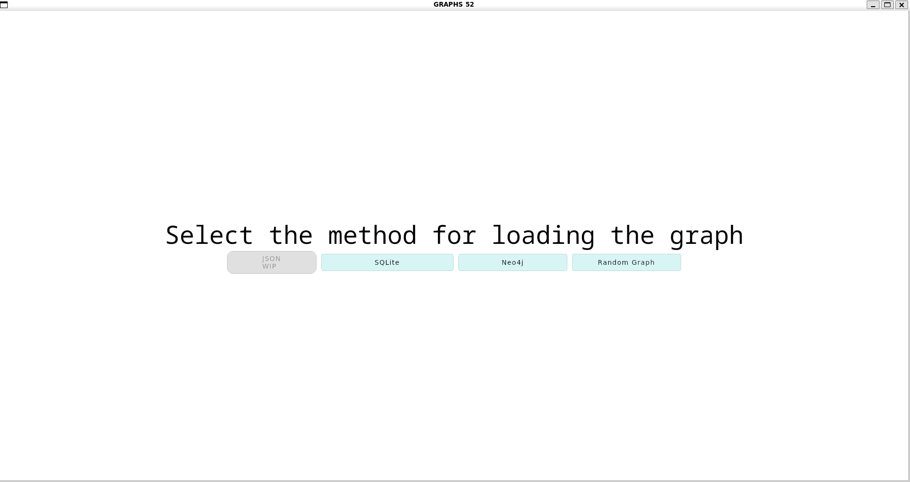

[](https://www.codefactor.io/repository/github/spbu-coding-2024/graphs-team-3)


[](https://neo4j.com/)
[](https://www.sqlite.org/)
# Graph Visualizer Application


## Technologies

- Kotlin 2.1.10
- Java 21
- SQLite
- Neo4j
- JUnit 5
- Jetpack Compose 1.7.1
- Gradle 8.13

## Architecture
We've implemented the **Model-View-ViewModel (MVVM)** architectural pattern

Blocks:
- Model (graph model, input/output, utilities)
- ViewModel (states, coloring)
- View (GUI elements)

## Start guide

- Download:
```bash
git clone git@github.com:spbu-coding-2024/graphs-team-3.git
cd graphs-team-3
```
- Build:
```bash
./gradlew build
```
- Run:
```bash
./gradlew run
```

# Algorithms

## Communities
#### Use Louvain algorithm


## Find Bridges


## Minimum Spanning Tree
#### Use Kruskal algorithm


## Path and negative loops find
#### Use Ford-Bellman algorithm


## Strongly Connected Components


# Load graph


You can:
- Load graph from SQLite database
- Load graph from Neo4j graph database
- Create random graph with settings

# Contributors

- [Gorlov Stepan](https://github.com/Stepiiiiiiik)
- [Yakovlev Nickolai](https://github.com/Nickovlev)

# License
[GPLv3](https://www.gnu.org/licenses/gpl-3.0.txt)
